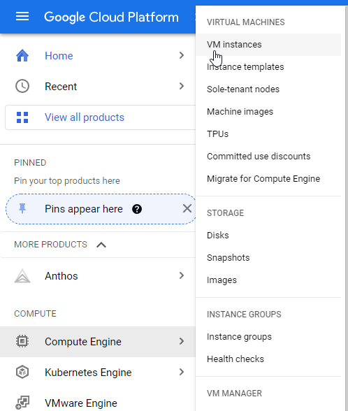

# Data Engineering Zoomcamp 2023

I'm participating in an open-source course - Data Engineering Zoomcamp by DataTalksClub. I'll keep here my notes and final project 

More about this course - https://github.com/DataTalksClub/data-engineering-zoomcamp

## The task
The goal is getting knowledge about Date Engineering. And having skill how to develop a data pipeline following the architecture below. We looked at New York City Taxi data.

Architecture diagram:

### [Week 1: Introduction & Prerequisites](week_1_basics_n_setup/)

Course overview

- Introduction to GCP
- Docker and docker-compose
- Running Postgres locally with Docker
- Setting up infrastructure on GCP with Terraform
- Preparing the environment for the course
- Homework

### [Week 2: Workflow Orchestration](week_2_workflow_orchestration/)

- Data Lake
- Workflow orchestration
- Workflow orchestration with Mage
- Homework

### [Week 3: Data Warehouse](week_3_data_warehouse/)

- Data Warehouse
- BigQuery
- Partitioning and clustering
- BigQuery best practices
- Internals of BigQuery
- Integrating BigQuery with Airflow
- BigQuery Machine Learning

### [Week 4: Analytics engineering](week_4_analytics_engineeringj/)

- Basics of analytics engineering
- dbt (data build tool)
- BigQuery and dbt
- Postgres and dbt
- dbt models
- Testing and documenting
- Deployment to the cloud and locally
- Visualizing the data with google data studio and metabase

### [Week 5: Batch processing](week_5_batch_processing/)

- Batch processing
- What is Spark
- Spark Dataframes
- Spark SQL
- Internals: GroupBy and joins

### [Week 6: Streaming](week_6_stream_processing/)

- Introduction to Kafka
- Schemas (avro)
- Kafka Streams
- Kafka Connect and KSQL

### [Week 7, 8 & 9: Project](week_7_project/)

Putting everything we learned to practice

- Week 7 and 8: working on your project
- Week 9: reviewing your peers

## Technologies

- *Google Cloud Platform (GCP)*: Cloud-based auto-scaling platform by Google
- *Google Cloud Storage (GCS)*: Data Lake
- *BigQuery*: Data Warehouse
- *Terraform*: Infrastructure-as-Code (IaC)
- *Docker*: Containerization
- *SQL*: Data Analysis & Exploration
- *Mage*: Workflow Orchestration
- *dbt*: Data Transformation
- *Spark*: Distributed Processing
- *Kafka*: Streaming

## Tools

For this course, you'll need to have the following software installed on your computer:

- Docker and Docker-Compose
- Python 3 (e.g. via [Anaconda](https://www.anaconda.com/products/individual))
- Google Cloud SDK
- Terraform

See [Week 1](week_1_basics_n_setup/) for more details about installing these tools

## Progress

## Final project