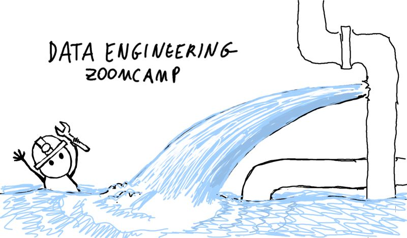

# Data Engineering Zoomcamp 2024

I'm participating in an open-source course - Data Engineering Zoomcamp by DataTalksClub. I'll keep here my notes and final project 

More about this course - https://github.com/DataTalksClub/data-engineering-zoomcamp

## The task
The goal is getting knowledge about Date Engineering. And having skill how to develop a data pipeline following the architecture below. We looked at New York City Taxi data.

Architecture diagram:

### [Module 1: Containerization and Infrastructure as Code](01-docker-terraform/)

In this part, I got some basics for setting up GCP. I configured VM, prepared the environment, and got some basic with IaC (terraform). I configured docker and deployed using docker-compose. I found out how to run Postgres locally with Docker. Finally, in homework, I set up Postgres using docker-compose, ingested data in Postgres and made SQL-queries to get some business features.

### [Module 2: Workflow Orchestration](02-workflow-orchestration/)

I have implemented ETL pipeline with Mage framework to read and combine data from CSV files, filter, transform, and load to PostgreSQL and to GCP.

### [Module 3: Data Warehouse](03-data-warehouse/)

- Data Warehouse
- BigQuery
- Partitioning and clustering
- BigQuery best practices
- Internals of BigQuery
- Integrating BigQuery with Airflow
- BigQuery Machine Learning

### [Module 4: Analytics engineering](04-analytics-engineering/)

- Basics of analytics engineering
- dbt (data build tool)
- BigQuery and dbt
- Postgres and dbt
- dbt models
- Testing and documenting
- Deployment to the cloud and locally
- Visualizing the data with google data studio and metabase

### [Module 5: Batch processing](05-batch/)

- Batch processing
- What is Spark
- Spark Dataframes
- Spark SQL
- Internals: GroupBy and joins

### [Module 6: Streaming](06-streaming/)

- Introduction to Kafka
- Schemas (avro)
- Kafka Streams
- Kafka Connect and KSQL

### [Week 7, 8 & 9: Project](week_7_project/)

Putting everything we learned to practice

- Week 7 and 8: working on your project
- Week 9: reviewing your peers

## Technologies

- *Google Cloud Platform (GCP)*: Cloud-based auto-scaling platform by Google
    - *Google Cloud Storage (GCS)*: Data Lake
    - *BigQuery*: Data Warehouse
- *Terraform*: Infrastructure-as-Code (IaC)
- *Docker*: Containerization
- *SQL*: Data Analysis & Exploration
- *Mage*: Workflow Orchestration
- *dbt*: Data Transformation
- *Spark*: Distributed Processing
- *Kafka*: Streaming

## Tools

For this course, you'll need to have the following software installed on your computer:

- Docker and Docker-Compose
- Python 3 (e.g. via [Anaconda](https://www.anaconda.com/products/individual))
- Google Cloud SDK
- Terraform

See [Week 1](week_1_basics_n_setup/) for more details about installing these tools

## Progress

## Final project