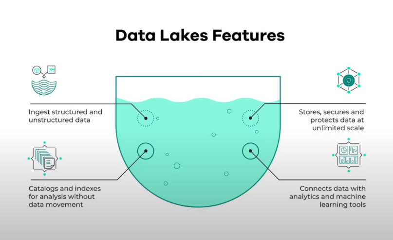

# Week 2: Workflow Orchestration

## What is a Data Lake
A Data Lake consists of a central repository where any type of data, either structured or unstructured, can be stored. The main idea behind a Data Lake is to ingest and make data available as quickly as possible inside an organization.



## Data Lake vs. Data Warehouse
A Data Lake stores a huge amount of data and are normally used for stream processing, machine learning and real time analytics. On the other hand, a Data Warehouse stores structured data for analytics and batch processing.


## Extract-Transform-Load (ETL) vs. Extract-Load-Transform (ELT)
ETL is usually a Data Warehouse solution, used mainly for small amount of data as a schema-on-write approach. On the other hand, ELT is a Data Lake solution, employed for large amounts of data as a schema-on-read approach.

## Prefect Data Orchestration
In this session, we are going to take a look at a basic python script that pulls the yellow taxi data into a postgres db and then transforms that script to be orchestrated with Prefect.

Prefect is the modern open source dataflow automation platform that will allow us to add observability and orchestration by utilizing python to write code as workflows to build,run and monitor pipelines at scale.

First lets create a conda environment


```python
conda create -n zoom python=3.9
```

And then we have to install the requirements found in requirements.txt  
```bash
pip install -r requirements.txt 
```

Now that we have everything install, that this script is going to call a function called ingest_data which takes the parameters for a postgres db connection and will pull the data specified as a parameter and then load it into the postgres db.

I’m going to be using pgAdmin4, and have already created the db named ny_taxi. Feel free to use whatever tool you are most familiar with to query postgres.

Let’s go ahead and run this script.

```bash
python ingest_data.py
```

Alright looking in pgAdmin4, we can see that the data ingested into the postgres db. This is great but I had to manually trigger this python script. Using a workflow orchestration tool will allow me to add a scheduler so that I won’t have to trigger this script manually anymore. Additionally, I’ll get all the functionality that comes with workflow orchestation such as visibility, add resilience to the dataflow with automatic retries or caching and more.

Let’s transform this into a Prefect flow. A flow is the most basic Prefect object that is a container for workflow logic and allows you to interact and understand the state of the workflow. Flows are like functions, they take inputs, preform work, and return an output. We can start by using the @flow decorator to a main_flow function.

Flows contain tasks so let’s transform ingest_data into a task by adding the @task decorator. Tasks are not required for flows but tasks are special because they receive metadata about upstream dependencies and the state of those dependencies before the function is run, which gives you the opportunity to have a task wait on the completion of another task before executing.

 - add ```@task(log_prints=True, retries=3)``` above ingest_data() function

Now let’s run the ingest_data.py as a Prefect flow.

```python ingest_data.py```

